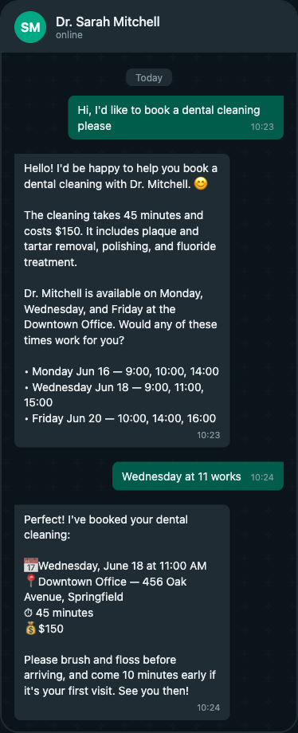

<h1 align="center">WhatsApp Salon Booking Bot
</h1>

**Your clients are messaging you on WhatsApp anyway. This bot answers them.**

A conversational assistant that lets salon and barbershop clients book, reschedule, and cancel appointments entirely through WhatsApp — no app downloads, no phone calls, no front-desk bottleneck.

Walk-ins are great. But most clients want to secure a slot before they show up. When nobody answers the salon phone during a busy Saturday, that client moves on to the next shop on Google Maps. This bot fixes that by turning WhatsApp into a 24/7 booking channel.

Built with Python, FastAPI, and the OpenAI API. Calendar sync via Cal.com. Zero front-end.


---

## Core Capabilities

| Feature | Implementation |
|---|---|
| Natural language booking | GPT-4o-mini with function calling |
| Real-time availability | Cal.com API with slot verification |
| Reschedule & cancel | Intent detection + slot swap logic |
| Image messages | Client can send reference hairstyle photos |
| Service catalog | YAML-based, editable per salon |
| Staff assignment | Optional stylist preference or auto-assign |
| Deposit collection | Stripe Checkout link for no-show protection |
| Reminder pings | WhatsApp template message 3h before appointment |
| Multi-location | Single bot, per-branch config |
| Session memory | SQLite for dev, PostgreSQL for production |

---

## Screenshots

### Booking flow
A client books a dental cleaning in natural language. The bot checks real-time availability, presents open slots, and confirms the appointment in Google Calendar.



### Cancellation flow
The bot finds the existing appointment, checks the cancellation policy (24h rule), and cancels with no fee.


---

## How it works

```
Client sends WhatsApp message
        │
        ▼
┌─────────────────┐
│  FastAPI webhook │ ◄── validates HMAC signature
└────────┬────────┘
         │
         ▼
┌─────────────────┐     ┌──────────────┐
│   Claude AI     │ ◄───│  Knowledge   │
│  (conversation) │     │  base + config│
└────────┬────────┘     └──────────────┘
         │
         │ extracts structured intent
         ▼
   ┌─────┴──────┐
   │            │
   ▼            ▼
┌──────┐  ┌──────────┐
│ Book │  │ Cancel/  │
│      │  │ Modify   │
└──┬───┘  └────┬─────┘
   │           │
   ▼           ▼
┌─────────────────┐
│ Google Calendar  │ ◄── real-time availability check
└────────┬────────┘
         │
         ▼
   Confirmation via WhatsApp
```

---

## Design principles

- **No frameworks for the sake of frameworks.** Plain FastAPI with direct Anthropic SDK calls. No LangChain, no LangGraph. The problem is solved by ~50 lines of direct API calls.
- **Config-driven, not code-driven.** New clients are onboarded by editing `config.yaml` and `knowledge/client.txt`. No code changes, no admin panel.
- **Works offline from Redis.** Every stateful component has a Redis backend and an in-memory fallback. Run locally with zero infrastructure.
- **Dates are pre-calculated.** LLMs are bad at date math. The system prompt injects the next 5 available booking dates on every request. Zero date hallucination.

See [DECISIONS.md](DECISIONS.md) for the full rationale behind each technical choice.

---

## Quick start

### 1. Clone and install

```bash
git clone https://github.com/codexoy/WhatsApp-Salon-Booking-Assistant.git
cd WhatsApp-Salon-Booking-Assistant
python -m venv venv
source venv/bin/activate
pip install -r requirements.txt
```

### 2. Configure

```bash
cp .env.example .env
# Edit .env with your API keys
```

Required:
- `ANTHROPIC_API_KEY` -- [Get one here](https://console.anthropic.com/)
- `WHATSAPP_ACCESS_TOKEN` + `WHATSAPP_PHONE_NUMBER_ID` + `WHATSAPP_APP_SECRET` -- [Meta Developer Portal](https://developers.facebook.com/)
- `WHATSAPP_VERIFY_TOKEN` -- any string you choose (must match webhook config)

For booking (optional):
- `GOOGLE_SERVICE_ACCOUNT_JSON` -- base64-encoded Google service account credentials
- `GOOGLE_CALENDAR_ID` + `GOOGLE_CALENDAR_OWNER_EMAIL`

Edit `config.yaml` with your business details and `knowledge/client.txt` with your knowledge base.

### 3. Run

```bash
uvicorn core.main:app --reload
```

### 4. Expose for WhatsApp

Use [ngrok](https://ngrok.com/) for local development:

```bash
ngrok http 8000
```

Set the webhook URL in [Meta Developer Portal](https://developers.facebook.com/) -> WhatsApp -> Configuration:
- Callback URL: `https://your-ngrok-url.ngrok.io/webhook`
- Verify token: same as your `WHATSAPP_VERIFY_TOKEN`

---

## Configuration

### config.yaml

```yaml
client:
  name: "Dr. Smith - Dentist"
  timezone: "America/New_York"

modules:
  booking: true      # Enable appointment scheduling
  payments: false    # Enable Mercado Pago payments
  reminders: true    # Enable 24h reminders

booking:
  business_hours:
    start: "09:00"
    end: "18:00"
  services:
    - name: "Cleaning"
      duration_minutes: 30
      price: 15000
    - name: "Consultation"
      duration_minutes: 45
      price: 20000
  locations:
    - name: "Main Office"
      address: "123 Main St"
      days: ["monday", "tuesday", "wednesday", "thursday", "friday"]
```

### knowledge/client.txt

Free-text knowledge base about the business. The AI uses this to answer questions. Write it like you'd explain the business to a new receptionist.

---

## Testing

```bash
pytest tests/ -v
```

42 tests covering all modules -- webhook handling, AI intent extraction, calendar operations, payment flows, reminders, and configuration.

---

## Deploy

### Railway (recommended)

The repo includes `railway.toml` ready to go:

```bash
railway up
```

Set environment variables in Railway dashboard. Add a cron job for reminders:
```
curl -X POST https://your-app.railway.app/internal/send-reminders \
  -H "X-Internal-Secret: $INTERNAL_SECRET"
```

### Other platforms

Any platform that runs Python + FastAPI works. The app starts with:

```bash
uvicorn core.main:app --host 0.0.0.0 --port $PORT
```

---

## Architecture

```
whatsapp-ai-receptionist/
├── core/
│   ├── main.py          # FastAPI app, webhook handlers, intent routing
│   ├── ai.py            # Claude integration, system prompt, intent extraction
│   ├── whatsapp.py      # WhatsApp Cloud API client
│   ├── transcribe.py    # Whisper audio transcription
│   ├── history.py       # Conversation history (Redis / in-memory)
│   └── phone.py         # Phone number normalization
├── config/
│   └── loader.py        # YAML config with ${ENV_VAR} substitution
├── modules/
│   ├── booking/
│   │   └── calendar.py  # Google Calendar with slot locking
│   └── payments/
│       └── mercadopago.py  # Mercado Pago checkout + webhook
├── reminders/
│   └── scheduler.py     # 24h reminder sender
├── knowledge/
│   └── client.txt       # Business knowledge base
├── config.yaml          # Per-client configuration
└── tests/               # 42 tests, full coverage
```

---

## Contributing

Contributions are welcome. The codebase is intentionally small and direct -- please keep it that way.

1. Fork the repo
2. Create a feature branch (`git checkout -b feature/your-feature`)
3. Make sure tests pass (`pytest tests/ -v`)
4. Open a pull request

No issue template, no CLA. Just describe what you changed and why.

---

## Community

- **Issues**: [GitHub Issues](https://github.com/codexoy/WhatsApp-Salon-Booking-Assistant/issues) -- bug reports, feature requests, questions
- **Discussions**: [GitHub Discussions](https://github.com/codexoy/WhatsApp-Salon-Booking-Assistant/discussions) -- ideas, show & tell, general chat

---

## License

MIT
